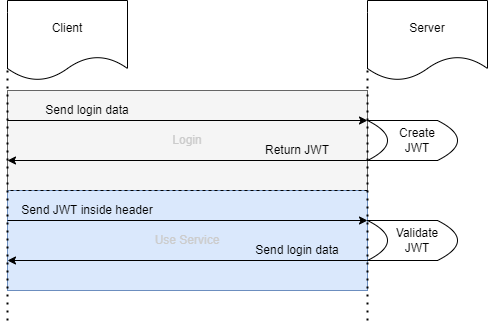

# :star: Managing users API - Main

> Status: Finished :heavy_check_mark:

> Reviewer: <https://github.com/PierreMjn>

> Assigned engineer: Pierre MIJON - Zian LI - Lindrit HISENI - Gregory Mendes :clipboard:

---

## :evergreen_tree: Tree structure

```
.backend/app
|---config/
|   |---auth.config.js
|   |---db.config.js
|
|---controller/
|   |---auth.controller.js
|   |---user.controller.js
|
|---middleware/
|   |---authJwt.js
|   |---index.js
|   |---verifySignUp.js
|
|---models/
|   |---index.js
|   |---role.model.js
|   |---user.model.js
|
|---routes/
|   |---auth.routes.js
|   |---user.routes.js
|
```

---

## :scroll: Project context

As part of the **Architecture and Software Quality** course, we have to design a fullstack school management application.

## :dart: Assigned task

In such a way, our team will focus on the **user management system**.

## :beginner: To begin

Provide yourself with an environment with [Wamp](https://www.wampserver.com/) and [NodeJS](https://nodejs.org/en/) installed.

### :gear: Prerequisites

What is **required** to get started with the project:

- [Git](https://git-scm.com/)
- [Wamp](https://www.wampserver.com/)
    - Make sure you credentials are :
        - **root** for username ;
        - Empty password for password;
    - Else, in the `db.config.js` file inside the `config` folder, change the credential in the URL as follow :
    ```javascript
    module.exports = {
        HOST: "YOUR_HOST",
        USER: "YOUR_USER",
        PASSWORD: "YOUR_PASSWORD",
        DB: "YOUR_DATABASE",
        dialect: "mysql",
        pool: {
           max: 5,
            min: 0,
            acquire: 30000,
            idle: 10000
        }
    };
    ```
- [NodeJS](https://nodejs.org/en/)

## :cd: Installation

- **Clone** the development application on your space :

    - **SSH** clone :
    ```
    git@github.com:PierreMjn/school-management-API.git
    ```
    - **HTTPs** Clone :
    ```
    https://github.com/PierreMjn/school-management-API.git
    ```
  
## :fire: Start-up

- Make sure you have your wamp server **running**.
- 
- **Navigate** into the `backend` folder of the project with :
```shell
cd school-managemnt-API
```
- Then, install all the npm dependencies using :
```shell
npm install
```
- From now, you an run the server with the following command :
```shell
npm start
```

:tada: Congratulations :tada:

The server is running on port **8080**.

## :key: About Json Web Token (JWT)

JWT authentication is really useful in order to connect multiple services between each other. Also, from just a token you can access you personal ressources without having to login when you are using a different service.

Here is the basic flow of JWT authentication :



As presented above, when the user log into the application, the server send a response containing his personal Json Web Token for this session.
Then, when accessing a service, this JWT has to be provided inside the header so the server can validate this token.

### Creating the token

We can divide it into 3 parts :
- Header
- Payload
- Signature

1. Header

The header typically consists of two parts: the type of the token, which is JWT, and the signing algorithm being used, such as HMAC SHA256 or RSA.
Example :
```JSON
{
  "alg": "HS256",
  "typ": "JWT"
}
```

2. Payload

The second part of the token is the payload, which contains the claims. Claims are statements about an entity (typically, the user) and additional data. There are three types of claims: registered, public, and private claims.

- **Registered claims:** These are a set of predefined claims which are not mandatory but recommended, to provide a set of useful, interoperable claims. Some of them are: iss (issuer), exp (expiration time), sub (subject), aud (audience), and others.

- **Public claims:** These can be defined at will by those using JWTs. But to avoid collisions they should be defined in the IANA JSON Web Token Registry or be defined as a URI that contains a collision resistant namespace.

- **Private claims:** These are the custom claims created to share information between parties that agree on using them and are neither registered or public claims.

For example in our case we can have the following payload :
```JSON
{
  "sub": "1234567890",
  "userId": "1",
  "firstname": "pierre",
  "lastname": "mijon",
  "email": "pierre.mijon@edu.ece.fr",
}
```

3. Signature

To create the signature part you have to take the encoded header, the encoded payload, a secret, the algorithm specified in the header, and sign that.

For example we have this kind of signature:
```JSON
HMACSHA256(
  base64UrlEncode(header) + "." +
  base64UrlEncode(payload),
  secret)
```

Here is the code to get the signature :
```JavaScript
const data = Base64UrlEncode(header) + '.' + Base64UrlEncode(payload);
const hashedData = Hash(data, secret);
const signature = Base64UrlEncode(hashedData);
```

Let’s explain it.

– First, we encode Header and Payload, join them with a dot .
```JavaScript
data = '[encodedHeader].[encodedPayload]'
```
– Next, we make a hash of the data using Hash algorithm (defined at Header) with a secret string.
– Finally, we encode the hashing result to get Signature.

4. Combining all

To create the final JWT, we will combine Header, Payload and Signature like :
```JavaScript
const encodedHeader = base64urlEncode(header);
/* Result example */
"OIZHdOZDOZDhDN8ZDf8ZFD76ZFA"

const encodedPayload = base64urlEncode(payload);
/* Result example */
"obzadOZUBDBdOBZDoBZDozdobZDobOdbO9678DABDçZIudqidb0DaoizdbdaozdgiuagdyfazdufIdgiuDzovDOVdOv"

const data = encodedHeader + "." + encodedPayload;
const hashedData = Hash(data, secret);
const signature = base64urlEncode(hashedData);
/* Result example */
"ihOdguiuzgduiGDoUDouBOdoUZDvo"

// header.payload.signature
const JWT = encodedHeader + "." + encodedPayload + "." + signature;
/* Result */
"ziodoqzbdoUZdouBQdD_ç6ZQDjkBbQOZdboqbdoqdboBDoBDoBQIDUvIdvzduoLYQdzvouCZDUOQCVdoUCQZDouVZDoUQVYdouCVQdoUVLQDlUVYQdoQVZdoVDZQouVDoQCDYTVZdLUQBDPQD"
```

### How Server validates JWT from Client

In previous section, we use a Secret string to create Signature. This Secret string is unique for every Application and must be stored securely in the server side.

When receiving JWT from Client, the Server get the Signature, verify that the Signature is correctly hashed by the same algorithm and Secret string as above. If it matches the Server’s signature, the JWT is valid.

## :pick: Made with

* [IntelliJ](https://www.jetbrains.com/fr-fr/idea/) - code editor

# :sunglasses: Author

* **Pierre Mijon** | [@Pierre Mijon](mailto:pierre.mijon@edu.ece.fr)

* **Zian LI** | [@Zian LI](mailto:zian.li@edu.ece.fr)

* **Lindrit HISENI** | [@Lindrit HISENI](mailto:lindrit.hiseni@edu.ece.fr)

* **Gregory Mendes** | [@Gregory](mailto:gregory.mendes@edu.ece.fr)

Students at [ECE Paris](https://www.ece.fr/).

Students (In industry engineering | informatics) at [ECAM](https://www.ecam.be/).

Read the list of [contributors](https://github.com/PierreMjn/School-management/graphs/contributors) to see who helped with the project !